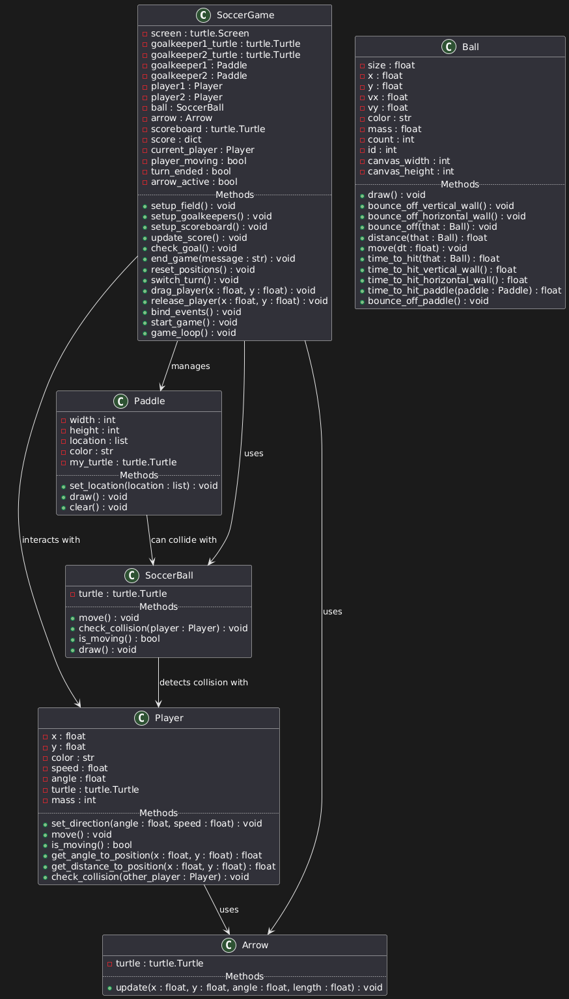

# Soccer Game


This project is a 2v2 Soccer Game developed as a part of the Computer Programming 1 Course. The game aims to simulate a soccer match with two players controlling goalkeepers and scoring goals.


## Project Description
Soccer Game is an interactive simulation where two players control goalkeepers to prevent the soccer ball from entering their respective goals. The game ends when one player scores 5 goals. It utilizes Python's turtle module for graphics and gameplay.

## Features
### Controls
Mouse Drag: Drag the player to set the direction and speed.


Collision:The game automatically updates the positions and checks for collisions.

## How to Install and Run the Project

### Prerequisites

Make sure you have the following installed on your system:
- Python 3.x
- `turtle` library (included with Python's standard library)

### Installation

1. **Clone the Repository**

    Open your terminal and clone the repository using the following command:

    ```bash
    git clone https://github.com/themeriboku/ball_bouncing_sim_oo.git
    ```

2. **Navigate to the Project Directory**

    ```bash
    cd ball_bouncing_sim_oo
    ```

3. **Ensure All Required Files Are Present**

    Make sure you have the following files in your project directory:
    - `run_game.py`
    - `paddle.py`
    - `Soccerball.py`
    - `arrow.py`
    - `player.py`

### Running the Project

1. **Execute the Main Script**

    Run the main script using Python:

    ```bash
    python run_game.py
    ```

    This command will start the Soccer Game application.

### Notes

- Ensure that all the `.py` files are in the same directory.
- The game will open in a new window using the `turtle` graphics library.

# UML Diagram


### Class Descriptions
- **SoccerGame:** Manages the game state, handles user input, and updates the game logic.
- **Paddle:** Represents the goalkeepers, which can be controlled to block the ball.
- **SoccerBall:** Represents the ball in the game, including its movement and interactions.
- **Arrow:** Visual aid for setting the direction and speed of player movement.
- **Player:** Represents the players on the field, including their position and movement logic.

### Class Interactions
- **SoccerGame** interacts with **Paddle**, **Player**, **SoccerBall**, and **Arrow** to manage the overall game state and render updates.
- **Player** objects can move and interact with the **SoccerBall**.
- **Paddle** objects act as goalkeepers and can block the **SoccerBall**.
- **Arrow** is used for visualizing the direction and speed of player movement.

### Extending the Baseline Code
The baseline code was extended by:
- Adding classes for **Paddle**, **Player**, **SoccerBall**, and **Arrow** to manage specific game elements.
- Implementing collision detection and handling between the **SoccerBall** and other game objects.
- Enhancing user interactivity by allowing drag-and-release functionality for players.

### Testing and Known Issues
The project was tested through various game scenarios to ensure correct behavior. However, the following issues are known:

#### Player and SoccerBall Collision
- **Issue:** The ball and player do not always detect collisions accurately, leading to unrealistic interactions.

#### Player Movement Outside Field Boundaries
- **Issue:** Players can move outside the designated field boundaries.

#### Paddle Collision
- **Issue:** The paddles (goalkeepers) do not always block the ball as expected.

